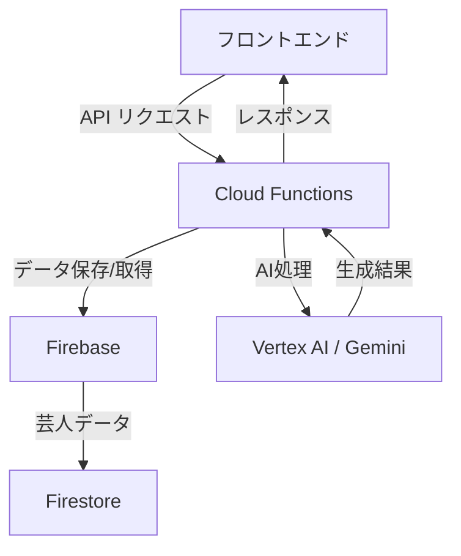

# AI漫才師 - AIによる漫才スクリプト生成システム

## プロジェクトの概要

本プロジェクトは、Vertex AI、Cloud Functions、Gemini、Firebase を活用した マルチエージェント漫才生成システム です。M-1グランプリの出場者データを活用し、AIが漫才スクリプトを自動生成することで、お笑い芸人やコンテンツクリエーターの創作支援を実現します。

## 技術スタック

### フロントエンド
- Next.js
- TypeScript

### バックエンド
- Cloud Functions
- Firebase (Firestore)
- Python

### AI/ML
- Vertex AI
- Gemini
- LangGraph
- Langchain

## ユーザー像と課題

### 対象ユーザー

本システムは以下のようなユーザーを対象としています：

#### お笑い芸人
- 新しいネタを作る時間を短縮したい
- 客観的な評価を得たい
- 既存のネタの改善点を見つけたい

#### 脚本家・ライター
- お笑い要素のあるストーリーのアイデアを得たい
- キャラクター間の掛け合いの参考にしたい
- コメディの新しい切り口を探したい

#### 動画クリエイター
- AIを活用した新しいコンテンツを作りたい
- 面白い台本を効率的に作成したい
- オリジナリティのある企画を立てたい

### 既存の課題

1. **ネタ作成の時間的コスト**
   - アイデア出しから完成まで多大な時間が必要
   - 試行錯誤の過程が非効率
   - 締切に追われる中での創作が困難

2. **客観的評価の難しさ**
   - ネタの面白さを数値化できない
   - 第三者からの適切なフィードバックが得にくい
   - 改善ポイントの特定が困難

3. **創作の行き詰まり**
   - 既存の発想から抜け出せない
   - 新しい切り口が見つけにくい
   - 独自のスタイルに固執しがち

## システムの特徴と工夫点

### 1. 実在する芸人データベースの活用

#### データ収集システム
- M-1グランプリの出場者データをスクレイピングで自動収集
- BeautifulSoupを使用したWebクローリング
- 敗者復活戦や決勝進出者の情報を優先的に収集

#### データ構造の最適化
```python
def get_random_comedians_data():
    scripts_ref = db.collection("Comedians")
    docs = list(scripts_ref.stream())
    random_docs = random.sample(docs, 2) if len(docs) >= 2 else docs
    return [doc.to_dict() for doc in random_docs]
```

- Firestoreのコレクション設計
  - Comedians: 芸人の基本情報
  - Judges: 審査員の基本情報
  - Scripts: 生成された漫才スクリプト
  - Evaluations: 審査結果

### 2. マルチエージェントアプローチ

#### エージェント構成
1. **ボケエージェント**
   - 独自のキャラクター性を持つ
   - コンテキストを考慮した発言生成
   - 実在する芸人のスタイルを参考

2. **ツッコミエージェント**
   - ボケに対する適切な反応
   - 会話の流れを制御
   - テンポ感の調整

3. **審査員エージェント**
   - 複数の評価基準での採点
   - 具体的なフィードバック提供
   - 改善提案の生成

#### エージェント間の連携
```python
def manzai_agents():
    manzai = ""
    boke_message = boke_agent("")
    manzai += f"{boke_message}\n"
    tsukkomi_message = tsukkomi_agent(boke_message)
    manzai += f"{tsukkomi_message}\n"

    judge_prompt = f"""
    以下の漫才のやり取りを採点してください。
    - ボケ: {boke_message}
    - ツッコミ: {tsukkomi_message}

    評価基準：
    - ボケの独創性
    - ツッコミの的確さ
    - 会話のテンポ
    """
```

### 3. 高度な品質管理システム

#### 評価基準
- ボケの独創性
- ツッコミの的確さ
- 会話のテンポ
- 文脈の一貫性
- 観客受けの予測

#### フィードバックループ
1. スクリプト生成
2. 審査員による評価
3. 改善点の特定
4. スクリプトの修正
5. 再評価

## 処理フロー詳細

### 1. テーマ生成フェーズ

#### テーマ生成の工夫
- 時事ネタの活用
- 一般的な話題のユニークな切り口
- 芸人の得意分野との関連付け

#### 実装例
```python
def generate_themes():
    model = GenerativeModel("gemini-pro")
    safety_settings = [
        SafetySetting("HARASSMENT", "BLOCK_MEDIUM_AND_ABOVE"),
        SafetySetting("HATE_SPEECH", "BLOCK_MEDIUM_AND_ABOVE"),
    ]
    
    response = model.generate_content(
        "現代的で面白い漫才のテーマを5つ提案してください",
        safety_settings=safety_settings
    )
    return response.text
```

### 2. スクリプト生成フェーズ

#### 会話生成の特徴
- 文脈を考慮した自然な展開
- テンポ感のある掛け合い
- 芸人の個性を反映

#### 実装例
```python
def generate_script(theme, comedian_style):
    prompt = f"""
    テーマ: {theme}
    スタイル: {comedian_style}
    
    以下の要素を含む漫才スクリプトを生成してください：
    - 起承転結のある展開
    - テンポの良い掛け合い
    - オチまでの自然な流れ
    """
    # Geminiによるスクリプト生成
```

### 3. 評価・改善フェーズ

#### 評価システムの特徴
- 数値評価とテキストフィードバック
- 具体的な改善提案
- 芸人の特徴を考慮した評価

## システムアーキテクチャ



## 今後の展望

### 1. 音声合成との連携
- 芸人の声質を模倣
- 感情表現の実装
- リアルタイム音声生成

### 2. アニメーション統合
- バーチャルキャラクター
- 表情や動きの自動生成
- インタラクティブ演出

### 3. 学習モデルの改善
- より自然な会話生成
- パーソナライズ機能
- リアルタイムフィードバック

## デモ動画

[動画を挿入予定]

## フィードバック

本プロジェクトの改善のため、以下の点についてご意見をお待ちしています：

- 生成されたスクリプトの品質
- 使用感や操作性
- 新機能のリクエスト

ご意見・ご質問は、Issues または Pull Requests にてお願いいたします。
